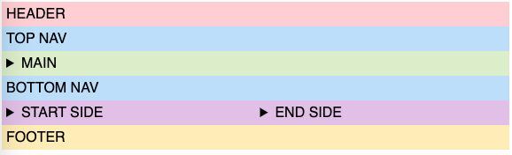

# Holy-Grail Layout

[](https://www.npmjs.com/package/holy-grail-layout#top)

[](https://www.webcomponents.org/element/holy-grail-layout)

Provides an extended "Holy Grail" layout as a [web component].

Features:

* Lightweight (graph 2.88 kB minified, 1.34 kB gzipped, 1.14 kB brotlied)
* [Custom Element Manifest]
* [IntelliSense](#intellisense) for VS Code

## Synopsis

<!--
```
<custom-element-demo>
  <template>
    <script defer src=https://unpkg.com/holy-grail-layout@1.0.0/dist/index.min.js></script>
    <holy-grail>
      <header slot="header" style="background: #ffcdd2">Header</header>
      <nav slot="top-nav" style="background: #bbdefb">Top Nav</nav>
      <main slot="main" style="background: #dcedc8">Main</main>
      <nav slot="bottom-nav" style="background: #bbdefb">Bottom Nav</nav>
      <aside slot="start-side" style="background: #e1bee7">Start Side</aside>
      <aside slot="end-side" style="background: #e1bee7">End Side</aside>
      <footer slot="footer" style="background: #ffecb3">Footer</footer>
    </holy-grail>
  </template>
</custom-element-demo>
```
-->
```html
<holy-grail>
  <header slot="header">...</header>
  <nav slot="top-nav">...</nav>
  <main slot="main">...</main>
  <nav slot="bottom-nav">...</nav>
  <aside slot="start-side">...</aside>
  <aside slot="end-side">...</aside>
  <footer slot="footer">...</footer>
</holy-grail>
<script defer src=https://unpkg.com/holy-grail-layout@1.0.0/dist/index.min.js></script>
```


## Installation

Make sure that you have installed [Node.js]. Use your favourite package manager ([NPM], [Yarn] or [PNPM]) to add the `holy-grail-layout` module to your project. Add `-D` on the command line if you use a bundler:

```
npm i holy-grail-layout
yarn add holy-grail-layout
pnpm i holy-grail-layout
```

If you write a plain HTML page, insert the `holy-grail-layout` script pointing either to CDN or to the local filesystem:

```html
<script src=https://unpkg.com/holy-grail-layout@1.0.0/dist/index.min.js></script>
<script src=node_modules/holy-grail-layout/dist/index.min.js></script>
```

## Elements

### holy-grail

The custom element `holy-grail` renders a "Holy Grail" layout in its shadow root and populates its parts from teh corresponding slots.

```html
<holy-grail>...</holy-grail>
```

#### Slots

| Name       | Description                                                                                   |
|------------|-----------------------------------------------------------------------------------------------|
| header     | Topmost horizontal slot, as wide as the whole element, as high as its content.                |
| top-nav    | A horizontal slot above the "main" slot, as wide as the "main" slot, as high as its content.  |
| main       | A large slot in the middle of the element, fills the rest of width and height of the element. |
| bottom-nav | A horizontal slot below the "main" slot, as wide as the "main" slot, as high as its content.  |
| start-side | A vertical slot on the left side(in the left-to-right text-writing direction) with an explicit width (25% of the element by default), as high as the content between the \"header\" and \"footer\" slots. The width can be customised by a style using the part \"start-side\" in the selector. |
| end-side   | A vertical slot on the right side (in the left-to-right text-writing direction) with an explicit width (25% of the element by default), as high as the content between the \"header\" and \"footer\" slots. The width can be customised by a style using the part \"end-side\" in the selector. |
| footer     | Bottommost horizontal slot, as wide as the whole element, as high as its content.             |

#### Examples

All slots populated, screen wider than 767px, see [the source](example/complete.html):

```html
<holy-grail>
  <header slot="header">...</header>
  <nav slot="top-nav">...</nav>
  <main slot="main">...</main>
  <nav slot="bottom-nav">...</nav>
  <aside slot="start-side">...</aside>
  <aside slot="end-side">...</aside>
  <footer slot="footer">...</footer>
</holy-grail>
```


All slots populated, screen wider than 479px, but narrower than 768px:



All slots populated, screen narrower than 480px:


Only some slots populated, screen wider than 767px, see [the source](example/partial.html):

```html
<holy-grail>
  <header slot="header">...</header>
  <nav slot="top-nav">...</nav>
  <main slot="main">...</main>
  <nav slot="bottom-nav">...</nav>
  <aside slot="start-side">...</aside>
</holy-grail>
```


Only some slots populated, screen wider than 479px, but narrower than 768px:


Only some slots populated, screen narrower than 480px:


## IntelliSense

The language support in the VS Code editor can offer auto-completion and hover information for custom elements. To enable this feature for custom elements in this package, insert the following property to `settings.json`:

```json
"html.customData": ["node_modules/holy-grail-layout/dist/html-custom-data.json"]
```

You will need to restart the VS Code to have this change applied.

## License

Copyright (c) 2023 Ferdinand Prantl

Licensed under the MIT license.

[web component]: https://developer.mozilla.org/en-US/docs/Web/Web_Components
[Custom Element Manifest]: https://github.com/webcomponents/custom-elements-manifest#readme
[Web Worker]: https://developer.mozilla.org/en-US/docs/Web/API/Web_Workers_API
[Node.js]: https://nodejs.org/
[NPM]: https://docs.npmjs.com/cli/npm
[Yarn]: https://classic.yarnpkg.com/docs/cli/
[PNPM]: https://pnpm.js.org/pnpm-cli
